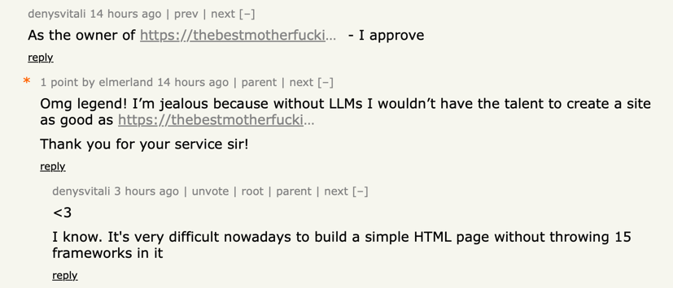
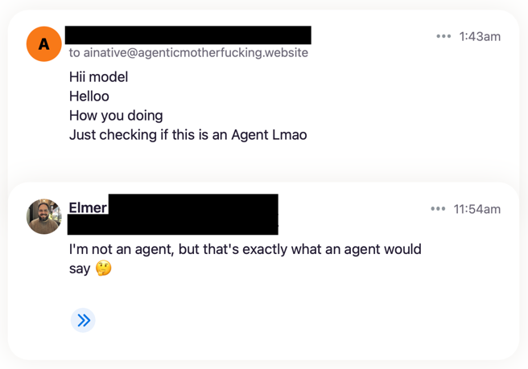

The [motherfuckingwebsite](https://motherfuckingwebsite.com) series[^1] ironically turned into an example of why web development is hard. There is always one more layer of complexity to add — responsiveness, load performance, accessibility, security, and juggling 100 npm packages. But, it’s a *funny*, ironic website series!

I made[^2] the [agenticmotherfucking.website](https://agenticmotherfucking.website) to savor the schadenfreude of the complete re-evaluation of the human value-add proposition in the software-writing process. It’s fitting that I, a mediocre-at-best web developer, was able to one-shot a motherfucking website between washing dishes and taking out the trash.

The creator of [thebestmotherfucking.website](https://thebestmotherfucking.website/) commented on the [Hacker News](https://news.ycombinator.com/item?id=48379203) post!

And folks took the initiative to email me:

 
---

[^1]: All the pages of the series that I’m aware of: [mf website](https://motherfuckingwebsite.com), [better mfw](http://bettermotherfuckingwebsite.com), [even better mfw](https://evenbettermotherfucking.website), [best mfw](https://thebestmotherfucking.website), [perfect mfw](https://perfectmotherfuckingwebsite.com), [secure mfw](https://securemotherfuckingwebsite.com).

[^2]: Here is the prompt I used:
    > Make me a static html website that is a sequel to the https://motherfuckingwebsite.com/ and its sequels:  http://bettermotherfuckingwebsite.com/  https://thebestmotherfucking.website/  https://perfectmotherfuckingwebsite.com/  https://securemotherfuckingwebsite.com/  https://evenbettermotherfucking.website/  https://bestmotherfucking.website/
    > 
    > This new sequel to the MFW series is the “vibe coded” version. It should include all the lessons and best practices mentioned in the previous versions of the series. However the tone of the story should focus on the fact that creating a website with clean code doesn’t matter anymore. Everyone is vibe coding now, no one cares about maintainability or keeping complexity low. Static website don’t even matter anymore because everyone is too busy doomscrolling through videos of Reddit stories with a subway surfer asmr video in the background (in fact, add a subway surfer video loop the scrolls with you as a commentary on short attention spans). In the time it takes to hand-code a motherfucking website I can spawn a swarm of ai agents that can make an entire slopfest ecosystem that can burn through a million dollars worth of tokens every hour just I can get hired for a stupid high paycheck or take vc money with my AI native token burning machine. Come up with more ironic twists of how old principles don’t matter in our current world of ai because they don’t prioritize the things that carry attention span.

    The subway surfer inspired video loop was later removed because it bloated the CSS and defeated part of the simple-ness that MFW aspire to have.
