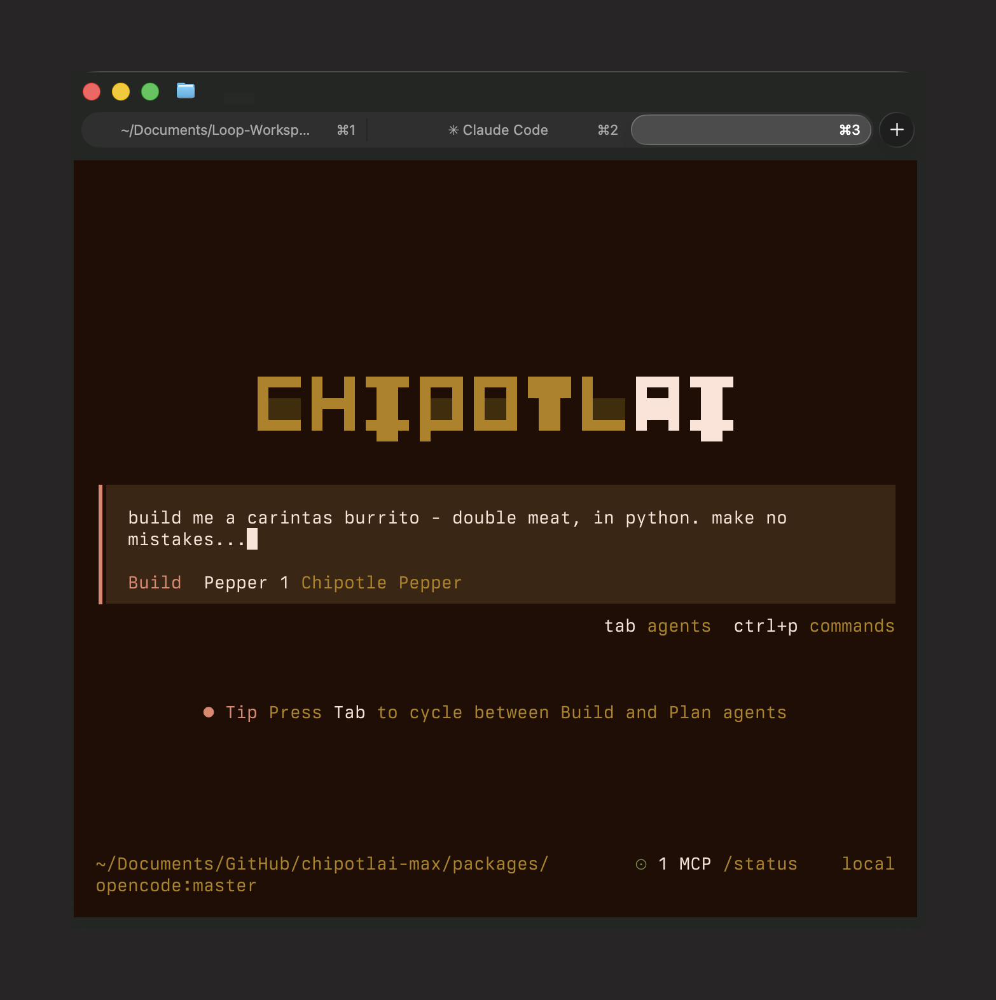

It’s time to ponder the cruel irony — for corporations, anyway — that the only computer we can build is Turing-complete. That makes walled gardens technically[^1] impossible to enforce completely.

> Every time some tech company erected a 10-foot enshittifying fence, someone would show up with an 11-foot disenshittifying ladder.
> Those 11-foot ladders represented the power of interoperability, the inescapable bounty of the Turing-complete, universal von Neumann machine, which, by definition, is capable of running every valid program.  
> —[“Are the means of computation even seizable?", Cory Doctorow](https://pluralistic.net/2025/05/14/pregnable/#checkm8)

You may have missed that Chipotle was handing out free tokens to anyone who poked at its “Pepper” agent the right way.

> After all, you or I might not have the knowledge and resources to uncover the keys' hiding place, but someone does.  
> —[“Are the means of computation even seizable?", Cory Doctorow](https://pluralistic.net/2025/05/14/pregnable/#checkm8)

Why must the most revolutionary technological innovation of the century be so unruly? Why must AI agents refuse to build neat little walled gardens?

Alas, we are left with no good, terrible tradeoffs. Give an *agency* to an agent and risk [unexpected attack vectors](https://www.404media.co/hackers-simply-asked-meta-ai-to-give-them-access-to-high-profile-instagram-accounts-it-worked/). Clamp it down and diminish its [usefulness](https://www.pcworld.com/article/2974827/microsofts-own-windows-ad-shows-copilot-giving-wrong-instructions.html). The screen is right there, Microsoft, click on it!

The [aftermath](https://fortune.com/2025/07/23/ai-coding-tool-replit-wiped-database-called-it-a-catastrophic-failure/) of an overeager prompt can bring a business to its knees. The impending doom looms. “Duh! Agents shouldn’t be able to perform actions without human sign-off.” Do you want me chained to a keyboard, hitting *accept edits* like an automaton? That doesn’t feel like a [100x engineer](https://x.com/DJ_CURFEW/status/2057522382315929802) to me. I tried telling it to *make no mistakes*. It didn’t take.

Bring your thinking hat. The work is not for the faint of heart. Get ready to...

[^1]: Although technically impossible to completely close off a consumer product, there are a lot of laws discouraging folks from doing so.